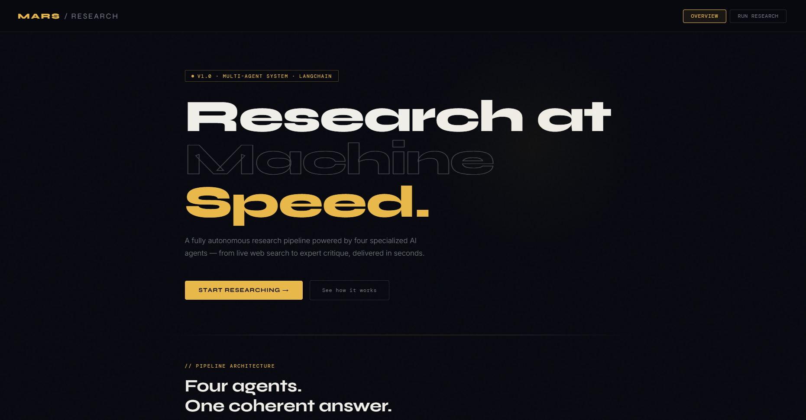
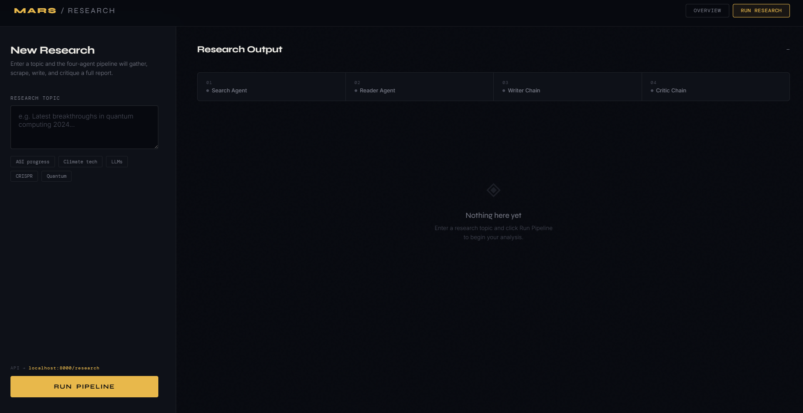
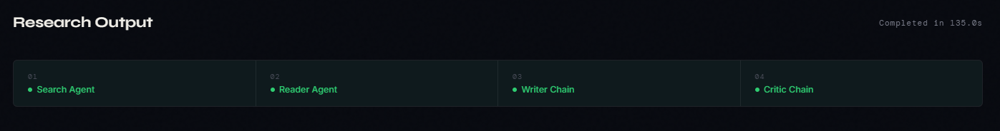
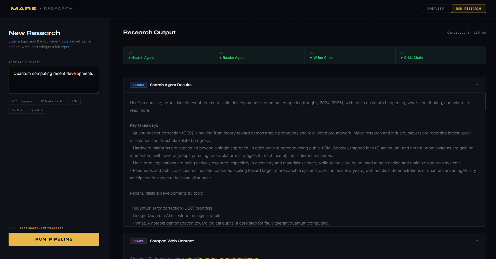

<div align="center">

<br/>

# MARS — Multi-Agent Research System

**An autonomous AI research pipeline that searches, scrapes, writes, and critiques — end to end.**


</div>

---

## What is MARS?

MARS is a **fully autonomous, multi-agent research system** that turns a single topic into a thoroughly researched, well-written, and critically reviewed report — with zero manual effort.

You type a topic. Four specialized AI agents take over:

- 🔍 One **searches** the live web for recent, reliable information
- 📄 One **scrapes** the most relevant source for deeper content
- ✍️ One **writes** a comprehensive research report from everything gathered
- 🔬 One **critiques** the report for accuracy, completeness, and quality

The entire pipeline runs end-to-end in under a minute, exposed via a clean **REST API** and a **dark-themed web interface**.

---

## Pipeline Architecture

```
User Input (topic)
        │
        ▼
┌───────────────────┐
│   Search Agent    │  ← Queries live web via Tavily Search API
│   (LangChain)     │    Finds recent, authoritative sources
└────────┬──────────┘
         │  search_result
         ▼
┌───────────────────┐
│   Reader Agent    │  ← Picks best URL from search results
│   (LangChain)     │    Scrapes full page content
└────────┬──────────┘
         │  scraped_content
         ▼
┌───────────────────┐
│   Writer Chain    │  ← Synthesizes search + scraped content
│   (LLM Chain)     │    Generates structured research report
└────────┬──────────┘
         │  report
         ▼
┌───────────────────┐
│   Critic Chain    │  ← Reviews report for quality & accuracy
│   (LLM Chain)     │    Returns structured feedback
└────────┬──────────┘
         │
         ▼
   Final Output (JSON)
```

---

## Screenshots
| Overview Page | Research Page |
|:---:|:---:|
|  |  |

| Pipeline Running | Results Output |
|:---:|:---:|
|  |  |

---

## Tech Stack

| Layer | Technology | Purpose |
|---|---|---|
| **Backend** | FastAPI | REST API framework |
| **Validation** | Pydantic v2 | Request/response schemas |
| **AI Agents** | LangChain | Agent orchestration |
| **LLM** | OpenAI GPT-4o | Writer & Critic chains |
| **Search** | Tavily Search API | Live web search |
| **Scraping** | BeautifulSoup / LangChain tools | Web content extraction |
| **Server** | Uvicorn | ASGI server |
| **Frontend** | HTML + CSS + Vanilla JS | Web interface |

---

## Project Structure

```
Multi_Agent_AI_Research_System/
│
├── api.py              # FastAPI app — routes, request/response models
├── pipeline.py         # Core pipeline — orchestrates all 4 agents
├── agents.py           # Agent definitions (search, reader, writer, critic)
│
├── index.html          # Frontend — two-page web interface
│
├── .env                # API keys (never commit this)
├── requirements.txt    # Python dependencies
└── README.md
```

---

## Getting Started

### Prerequisites

- Python 3.11+
- OpenAI API key
- Tavily API key

### 1. Clone the repository

```bash
git clone https://github.com/your-username/Multi-Agent-AI-Research-System.git
cd Multi-Agent-AI-Research-System
```

### 2. Create and activate virtual environment

```bash
python -m venv .venv

# Windows
.venv\Scripts\activate

# macOS / Linux
source .venv/bin/activate
```

### 3. Install dependencies

```bash
pip install -r requirements.txt
```

### 4. Set up environment variables

Create a `.env` file in the root directory:

```env
OPENAI_API_KEY=your_openai_api_key_here
TAVILY_API_KEY=your_tavily_api_key_here
```

### 5. Run the API

```bash
uvicorn api:app --reload
```

API will be live at: `http://127.0.0.1:8000`

### 6. Run the Frontend

Open a second terminal:

```bash
python -m http.server 5500
```

Open your browser at: `http://localhost:5500/index.html`

---

## API Reference

### Health Check

```http
GET /
```

**Response**
```json
{
  "status": "ok",
  "message": "Research Pipeline API is running"
}
```

---

### Run Research Pipeline

```http
POST /research
```

**Request Body**

```json
{
  "topic": "Latest breakthroughs in quantum computing 2024"
}
```

| Field | Type | Validation | Description |
|---|---|---|---|
| `topic` | `string` | min 3, max 300 chars | The topic to research |

**Response**

```json
{
  "search_result": "...",
  "scraped_content": "...",
  "report": "...",
  "feedback": "..."
}
```

| Field | Description |
|---|---|
| `search_result` | Raw output from the Search Agent |
| `scraped_content` | Content scraped from the top source URL |
| `report` | Full research report written by the Writer chain |
| `feedback` | Critic's structured review of the report |

---

### Interactive Docs

FastAPI auto-generates interactive API documentation:

```
http://127.0.0.1:8000/docs      ← Swagger UI
http://127.0.0.1:8000/redoc     ← ReDoc
```

---

## How the Agents Work

### 🔍 Search Agent
Built with LangChain's agent framework and powered by the **Tavily Search API**. Given a topic, it autonomously decides what to search, runs multiple queries if needed, and returns a consolidated summary of the most recent and reliable information found online.

### 📄 Reader Agent
Takes the search results and identifies the single most relevant URL. It then uses a web scraping tool to extract the full content of that page — going far beyond what snippets provide — and returns structured, detailed content.

### ✍️ Writer Chain
A focused LLM chain (not an agent) that receives both the search summary and scraped content, then synthesizes them into a comprehensive, well-structured research report. It follows a consistent format: overview, key findings, analysis, and sources.

### 🔬 Critic Chain
Another LLM chain that acts as a peer reviewer. It reads the draft report and evaluates it across multiple dimensions — factual accuracy, completeness, bias, clarity, and source quality — returning structured written feedback.

---

## Environment Variables

| Variable | Required | Description |
|---|---|---|
| `OPENAI_API_KEY` | ✅ | Powers Writer and Critic chains |
| `TAVILY_API_KEY` | ✅ | Powers Search Agent's web queries |

---

## Requirements

```txt
fastapi
uvicorn
pydantic
langchain
langchain-openai
langchain-community
tavily-python
beautifulsoup4
requests
python-dotenv
```

Install all at once:

```bash
pip install fastapi uvicorn pydantic langchain langchain-openai langchain-community tavily-python beautifulsoup4 requests python-dotenv
```

---

## Roadmap

- [x] Search Agent with Tavily
- [x] Reader Agent with web scraping
- [x] Writer Chain
- [x] Critic Chain
- [x] FastAPI REST endpoint
- [x] Web frontend with live pipeline tracker
- [ ] Streaming responses (server-sent events)
- [ ] Multi-URL scraping support
- [ ] Export report as PDF
- [ ] Chat-based follow-up questions on the report
- [ ] Docker support

---

## License

This project is licensed under the MIT License — see the [LICENSE](LICENSE) file for details.

---

<div align="center">

Built with curiosity. Documented with honesty.

</div>
